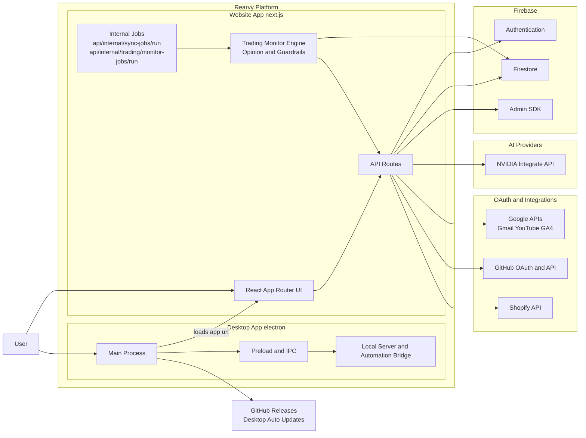

# Rearvy 2.0

Rearvy is an AI business assistant for connected data, research, writing, approvals, and execution. This repository contains the full-stack codebase for the Rearvy platform, including the website dashboard, desktop app, backend API, and integrations.

## Stack

- Next.js (App Router) + React + TypeScript
- Firebase (Authentication, Firestore, Admin SDK)
- Vercel AI SDK + NVIDIA

## Architecture



Notes:
- In local development, `npm run dev:both` starts the website and then opens the desktop app pointed at the local website URL.
- In production desktop mode, Electron loads the packaged or hosted app URL and checks GitHub Releases for updates.
- Internal worker routes handle durable sync and trading monitor cycles without direct user interaction.

## Local setup

1. Install dependencies:

```bash
npm install
```

1. Copy env vars and fill values:

```bash
cp .env.example .env.local
```

1. Start dev server:

```bash
npm run dev:both
```

For detailed setup instructions including the terminal server and separate dev processes, see [Terminal Server Startup Guide](./TERMINAL_SERVER_STARTUP.md).

## Desktop app packaging

Rearvy can be shipped as a Windows desktop installer using Electron. The desktop app now uses its own native renderer instead of the website dashboard shell, with desktop-only bridge features for local workflows.

- Electron now loads the standalone desktop app renderer by default.
- The desktop installer includes the local native renderer plus Electron bridge code.
- Private backend secrets are not bundled into the installer.

```bash
npm run desktop:dev
npm run desktop:build:win
```

Simple command aliases:

```bash
npm run app:install
npm run app:run
npm run app:run:web
npm run app:run:desktop
npm run app:build:win
```

`desktop:build:win` creates a Windows installer in a timestamped `desktop-release/` subfolder and stages copies at:

```text
public/downloads/RearvyUserSetup-x64.exe
public/downloads/RearvyUserSetup-x64-<version>.exe
public/downloads/RearvyUserSetup-x64.exe.blockmap
public/downloads/latest.json
public/downloads/latest.yml
website/public/downloads/RearvyUserSetup-x64.exe
website/public/downloads/RearvyUserSetup-x64-<version>.exe
website/public/downloads/RearvyUserSetup-x64.exe.blockmap
website/public/downloads/latest.json
website/public/downloads/latest.yml
```

The website download page is available at `/download`. If you host the installer outside this repo, set `NEXT_PUBLIC_WINDOWS_DOWNLOAD_URL` to the installer URL before building/deploying the web app.

Desktop packaging workflow:

1. Export the website bundle for desktop.
2. Build the Windows installer with Electron Builder.
3. Stage the installer into `public/downloads/` and `website/public/downloads/`.

Desktop bridge features available in the app:

- Terminal command execution
- File picker plus read/write
- Clipboard read/write
- Screen capture and desktop notifications
- Desktop workflows run directly for app navigation, mouse movement/click/drag, typing, key presses, clipboard, and scrolling, and manual mouse movement interrupts active control
- Emergency stop shortcut for active desktop control: `Ctrl+Alt+Shift+S` on Windows/Linux or `Cmd+Alt+Shift+S` on macOS
- Serial, USB, and HID device access

## Desktop dependencies and updates

Install all required dependencies for root + website + desktop app in one terminal command:

```bash
npm run install:all
```

Desktop updates are now built in:

- The desktop app checks for updates on startup and periodically while running.
- If an update is found, it is downloaded and users can install it from the profile menu using "Install update and restart".
- Windows installer is configured as per-user install (`AppData/Local/Programs`) and allows users to choose install location.

## Required environment variables

- `NEXT_PUBLIC_FIREBASE_API_KEY`
- `NEXT_PUBLIC_FIREBASE_AUTH_DOMAIN`
- `NEXT_PUBLIC_FIREBASE_PROJECT_ID`
- `NEXT_PUBLIC_FIREBASE_STORAGE_BUCKET`
- `NEXT_PUBLIC_FIREBASE_MESSAGING_SENDER_ID`
- `NEXT_PUBLIC_FIREBASE_APP_ID`
- `FIREBASE_SERVICE_ACCOUNT`
- `NVIDIA_API_KEY`
- `BROWSERBASE_API_KEY` and `BROWSERBASE_PROJECT_ID` (optional, enable the Vercel-hosted Cloud Computer browser runtime)
- `BROWSERBASE_REGION` (optional, defaults to `us-west-2`)
- `CLOUD_COMPUTER_ENABLED` (optional, set `true` to enable Browserbase cloud browser sessions)
- `CLOUD_COMPUTER_MAX_ACTIVE_SESSIONS` (optional, defaults to `1`)
- `IMAGE_GENERATION_WEB_SEARCH` (optional, defaults to enabled; set `false` to skip pre-generation web search)
- `MEDIA_IMAGE_PROVIDER` (optional, `auto`, `cloudflare`, or `nvidia`; image generation uses Cloudflare Workers AI when configured, otherwise NVIDIA Qwen when a deployed NIM URL is configured.)
- `MEDIA_VIDEO_PROVIDER` (optional, `auto` or `nvidia`; set `nvidia` to force NVIDIA Cosmos video generation)
- `CLOUDFLARE_ACCOUNT_ID` and `CLOUDFLARE_AI_API_TOKEN` (optional, enable Cloudflare Workers AI image generation)
- `CLOUDFLARE_IMAGE_MODEL` (optional, defaults to `@cf/black-forest-labs/flux-1-schnell`)
- `NVIDIA_GLM_API_KEY` (optional, per-model NVIDIA key for `z-ai/glm-5.1`; falls back to `NVIDIA_API_KEY`)
- `NVIDIA_DEEPSEEK_API_KEY` (optional, per-model NVIDIA key for `deepseek-ai/deepseek-v4-pro`; falls back to `NVIDIA_API_KEY`)
- `NVIDIA_NEMOTRON_API_KEY` (optional, per-model NVIDIA key for Nemotron reasoning models; falls back to `NVIDIA_API_KEY`)
- `NVIDIA_IMAGE_MODEL` (optional, defaults to `qwen-image-2512` for NVIDIA image generation)
- `NVIDIA_IMAGE_API_KEY` (optional, image-specific NVIDIA key for Qwen image generation/editing; falls back to `NVIDIA_API_KEY`)
- `NVIDIA_IMAGE_BASE_URL` (required for NVIDIA Qwen image generation/editing; set this to your deployed Qwen NIM `/v1` URL, not the public NVIDIA Integrate base URL)
- `NVIDIA_COSMOS_BASE_URL` or `NVIDIA_COSMOS_INFER_URL` (optional, points video generation to a Cosmos NIM `/v1/infer` endpoint)
- `NVIDIA_COSMOS_VIDEO_MODEL` (optional, defaults to `nvidia/cosmos-predict1-7b`)
- `OPENROUTER_API_KEY` (optional, enables OpenRouter free/open-source model routing)
- `OPENROUTER_BASE_URL` (optional, defaults to `https://openrouter.ai/api/v1`)
- `OPENROUTER_VIDEO_MODEL` (optional, defaults to `google/veo-3.1` for OpenRouter video jobs)
- `INTEGRATION_ENCRYPTION_KEY` (32-byte hex)
- `NEXT_PUBLIC_APP_URL`
- `WORK_SCHEDULER_SECRET` (guards `/api/internal/work/scheduler/run`)
- `WORK_RUNNER_SECRET` (optional; guards `/api/internal/work/runner/run`)
- Channel provider credentials are optional until you activate a provider:
  Telegram, Discord, Slack, WhatsApp Cloud API, WeChat, DingTalk, and Lark.
- Source research credentials are optional until you activate official APIs:
  Reddit, TikTok, and Alibaba/AliExpress/1688-style supplier research.

## Work Platform

The Work Platform lives at `/work` and includes Automations, Browser,
Integrations, Memory, Channels, Pairing, Sources, Processes, and Runs. Rearvy
abilities are built in, so no separate setup step is required to unlock core
tools.

- Full local mode: run `npm run dev:both` from the repository root.
- Web-only mode: run `npm run dev:web`.
- Work Platform local browser/desktop actions outside Maria stay approval-gated
  and require the desktop/dev runtime or a paired desktop device.
- Channel sends require approval unless the channel connection explicitly enables
  auto-reply.
- Source research uses configured official APIs first. When credentials are not
  configured, public-page browser fallback tasks require explicit approval.

## Google OAuth setup

This app uses two separate Google auth flows, and each one needs its own redirect URI configuration.

Firebase app sign-in:

- Login and signup use the Firebase client SDK.
- Enable Google in Firebase Authentication.
- In Firebase Authentication -> Settings -> Authorized domains, add every hostname you use to open the app.
- `localhost` does not cover `127.0.0.1`, and neither one covers a LAN IP like `192.168.1.25`.
- In the Google Cloud OAuth client used by Firebase, add this redirect URI:

```text
https://<NEXT_PUBLIC_FIREBASE_AUTH_DOMAIN>/__/auth/handler
```

- With the current Firebase config in this workspace, that URI is:

```text
https://www.rearvy.com/__/auth/handler
```

- For local development with this repo, the common entries are `localhost` and `127.0.0.1`.

Google integrations:

- Gmail, YouTube, and Google Analytics use `GOOGLE_CLIENT_ID` and `GOOGLE_CLIENT_SECRET`.
- New Google connections reuse a single shared callback URL per hostname, so one Google Cloud redirect can cover all three integrations on that host.
- Enable the Gmail API in the Google Cloud project that owns `GOOGLE_CLIENT_ID` before trying a Gmail sync.
- If Gmail sync returns `GMAIL_API_DISABLED`, open Google Cloud Console -> APIs & Services -> Library, enable `Gmail API`, wait a few minutes, and retry.
- If your Google Cloud OAuth client is registered against a different host than `NEXT_PUBLIC_APP_URL`, set `GOOGLE_OAUTH_REDIRECT_ORIGIN` to the exact origin you registered.
- Register the exact hostname you actually open the app on. With the app running at `http://localhost:3000`, add:

```text
http://localhost:3000/api/integrations/google-analytics/callback
```

- Add the production callback too if you run the app on Rearvy production:

```text
https://www.rearvy.com/api/integrations/google-analytics/callback
```

- `rearvy.com` currently redirects to `www.rearvy.com`, so register the `www` hostname in Google Cloud for production OAuth callbacks.
- The redirect URI sent to Google is built from `GOOGLE_OAUTH_REDIRECT_ORIGIN` when set, then `NEXT_PUBLIC_APP_URL`, then the request origin.
- Legacy per-provider callback routes still exist, but new authorization requests use the shared callback above.
- For Google Analytics integration, ensure both Google Analytics Admin API and Google Analytics Data API are enabled in the same Google Cloud project as `GOOGLE_CLIENT_ID`.
- If GA4 connect/sync returns `GA4_API_DISABLED`, open the activation URL shown in the app, enable the API, wait a few minutes, and retry.

GitHub integration:

- `GITHUB_CLIENT_ID`
- `GITHUB_CLIENT_SECRET`
- Register this OAuth callback URI in the GitHub OAuth App:

```text
https://<NEXT_PUBLIC_APP_URL>/api/integrations/github/callback
```

- GitHub connect uses `read:user`, `user:email`, `read:org`, and `repo` so Rearvy can read repository metadata, recent issues, and pull requests for connected accounts.

Shopify:

- `SHOPIFY_API_KEY`
- `SHOPIFY_API_SECRET`
- `SHOPIFY_WEBHOOK_SECRET`

GitHub:

- `GITHUB_CLIENT_ID`
- `GITHUB_CLIENT_SECRET`

YouTube:

- `GOOGLE_CLIENT_ID`
- `GOOGLE_CLIENT_SECRET`
- Enable YouTube Data API v3 in the same Google Cloud project that owns `GOOGLE_CLIENT_ID` before attempting a YouTube sync.
- If YouTube sync returns `YOUTUBE_API_DISABLED`, open the activation URL shown in the app, enable the API, wait a few minutes, and retry.

Sync worker:

- `SYNC_WORKER_SECRET` (used by internal sync worker route)

## Commands

```bash
npm run dev:both
npm run dev:web
npm run lint
npm run build
npm run start
```

## AI chat troubleshooting

- The main chat and demo chat require `NVIDIA_API_KEY` on the server runtime.
- The default chat model is `moonshotai/kimi-k2.6` via NVIDIA Integrate API.
- Reasoning and workflow tasks can use `NVIDIA_REASONING_MODEL`/`NVIDIA_WORKFLOW_MODEL`; the env template uses `nvidia/nemotron-3-ultra-550b-a55b` with `NVIDIA_REASONING_BUDGET=16384`.
- NVIDIA Nemotron reasoning models receive `chat_template_kwargs.enable_thinking=true` and `reasoning_budget` automatically when thinking mode is active.
- Image generation uses Cloudflare Workers AI when `CLOUDFLARE_ACCOUNT_ID` and `CLOUDFLARE_AI_API_TOKEN` are configured. NVIDIA Qwen image generation/editing is still supported, but it is a downloadable Visual GenAI NIM path, so `NVIDIA_IMAGE_BASE_URL` must point at your deployed Qwen NIM `/v1` endpoint and `NVIDIA_IMAGE_MODEL=qwen-image-2512`.
- If chat fails with a server error, verify `NVIDIA_API_KEY` is present in your deployment environment and redeploy.

## Database migrations

Migrations live in `supabase/migrations`.

To run all migrations against Supabase Postgres:

```bash
node run_migrations.mjs <DATABASE_PASSWORD>
```

Or:

```bash
SUPABASE_DB_PASSWORD=<DATABASE_PASSWORD> node run_migrations.mjs
```

## Integration sync behavior

- OAuth callbacks enqueue durable sync jobs.
- Jobs retry with backoff on failure.
- An internal worker route processes due jobs: `POST /api/internal/sync-jobs/run`.

## Website email setup

This project sends product feedback and business free-access requests directly to email addresses instead of storing them in Firestore for admin triage.

- Required env vars for website email delivery (website app):
	- `RESEND_API_KEY` — API key for Resend.
	- `FEEDBACK_RECIPIENT` — Recipient email for feedback (default: `mutalvita@gmail.com`).
	- `BUSINESS_FREEMIUM_RECIPIENT` — Recipient email for business free-access requests (default: `myrearvy@gmail.com`).
	- `RESEND_SENDER` (optional) — Sender address to use for outgoing mail. The default `onboarding@resend.dev` sender is for testing only; use a verified domain sender in production.

See `website/.env.example` for a small example of the required variables.
